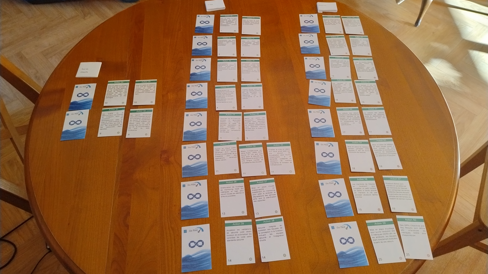
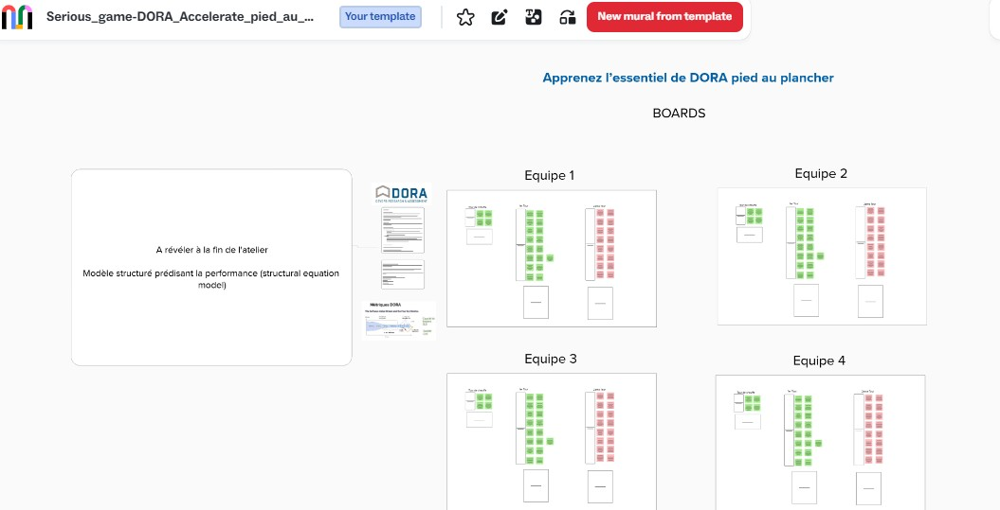

# DORA Accelerate pied au plancher 

_Atelier pour découvrir et apprendre l’essentiel de “Accelerate” / DORA pied au plancher_

## Accelerate / DORA c’est quoi ?

DORA: (Dev Ops Research Assesments) ou Rapports annuels sur l’état du Devops en Français, rapports qui ont été conduits par l'équipe de recherche DORA et issus d’évaluations / questionnaires sur pratiques d’entreprises.
Ces rapports ont identifié des capacités clés (techniques, managériales et culturelles) avec comme conclusion que la performance de la livraison de logiciels est un moteur direct de la performance organisationnelle (productivité, rentabilité, parts de marché).pour accélérer le développement et la livraison de logiciel, tout en garantissant la stabilité. Ces capacités clé permettent de livrer des logiciels plus vite et de manière plus stable, sans compromis.

Le livre Accelerate (paru en 2018) détaille les découvertes et la science se cachant derrière cette recherche.

## Présentation de l'atelier

Cet atelier a été présenté à Agile game Toulouse 2024 et Agile tour Toulouse 2025.

L’idée de base est de faire découvrir et mieux appréhender par petits groupes de manière ludique les concepts et résultats issus du livre Accelerate et de DORA.
 
L’objectif de ce serious game est de trouver le maximum d’actions optimales (associées aux capacités clés) permettant d’améliorer les métriques DORA. C’est l'occasion d'explorer les meilleures pratiques / leviers d’actions et leurs challenges côté DevOps, lean management et produit.

Atelier pour des groupes max de 5 à 6 personnes maximum, durée 1 heure (à adapter en fonction du nombre de cartes utilisées).

### Déroulement de l'atelier

Une possibilité d’animation est de découper l’atelier en 3 phases (effectuées en groupes. Prévoir plusieurs facilitateurs si besoin. Durée de chaque phase à titre indicatif) avec une introduction et une conclusion avec moment d’échange avec tout le monde.

[Détails sur l'atelier et aide pour le facilitateur](ressources/Aide-et-Facilitation-pour-atelier-DORA-pied-au-plancher.pdf)

Découpage des phases:

- Introduction à DORA / Accelerate et présentation de l’atelier - 8’
- Une 1ere phase d’échauffement et de découverte du déroulement de l’atelier - 8’
	- Chaque groupe découvre les actions associées à 2 capacités et sélectionne les plus pertinentes
	- Correction et débriefing
- Une 2eme phase pour découvrir les capacités orientées technique les plus pertinentes - 18’
	- Chaque groupe découvre les actions associées à 2 capacités et sélectionne les plus pertinentes
	- Correction et débriefing
- Une 3eme phase pour découvrir les capacités orientées Lean / produit les plus pertinentes - 18’
	- Chaque groupe découvre les actions associées à 2 capacités et sélectionne les plus pertinentes
	- Correction et débriefring
- Débriefing global, séance Q/R, Feedbacks - 8’

### Version atelier en présentiel

Cet atelier peut être effectué en présentiel avec jeu de cartes à imprimer et découper.

[Présentation de l'atelier à Agile tour Toulouse 2025](Ressources/Accelerate - Agile Tour Tlse 2025.pdf)

#### Instructions pour utilisation des cartes 

[Cartes](print/Cartes-pour-atelier-DORA-Accelerate-pied-au-plancher.pdf)

- Imprimer en recto / verso à l'aide d'une imprimante couleur
- Utilisez une paire de ciseaux ou une découpeuse pour séparer soigneusement la ligne entre deux cartes différentes.
- Pas besoin de colle, sauf si vous avez raté l'instruction précédente dans ce cas : collez le recto et le verso de la carte avec une petite quantité de colle.
- Plastifier
- Arrondir les angles pour rendre la manipulation plus agréable.

## Version atelier à distance

Il peut également être effectué à distance, un template Mural est disponible:

[https://app.mural.co/t/dev18468/template/5a027682-c5cd-45e4-9035-80b7f95781bd] (https://app.mural.co/t/dev18468/template/5a027682-c5cd-45e4-9035-80b7f95781bd)

## Attribution

DORA is a long running research program that seeks to understand the capabilities that drive software delivery and operations performance.
Link: [http://dora.dev](https://dora.dev/)

Accelerate _The Science of Lean Software and DevOps: Building and Scaling High Performing Technology Organizations_ is a book by By Nicole Forsgren, Jez Humble and Gene Kim (2018).

## License
DORA is a program run by Google Cloud. All content on DORA site is licensed by Google LLC under CC BY-NC-SA 4.0, unless otherwise specified. For more information see the [license file](LICENSE.md)

